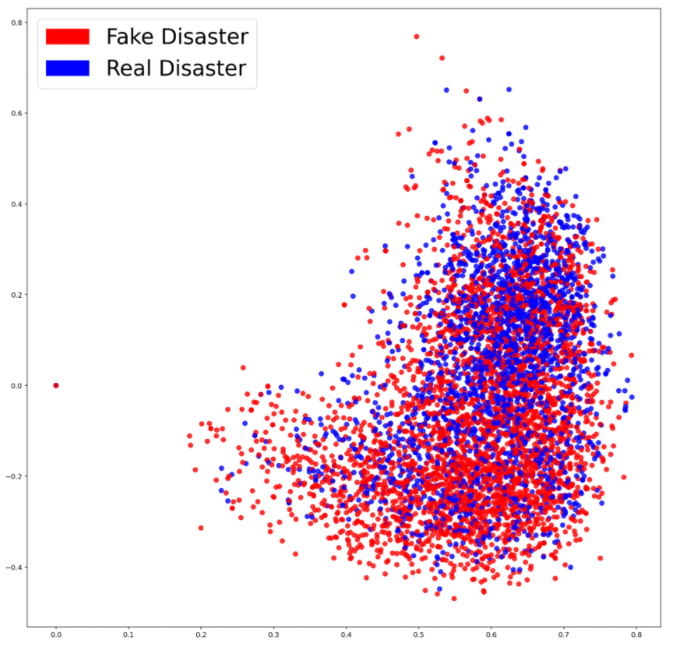
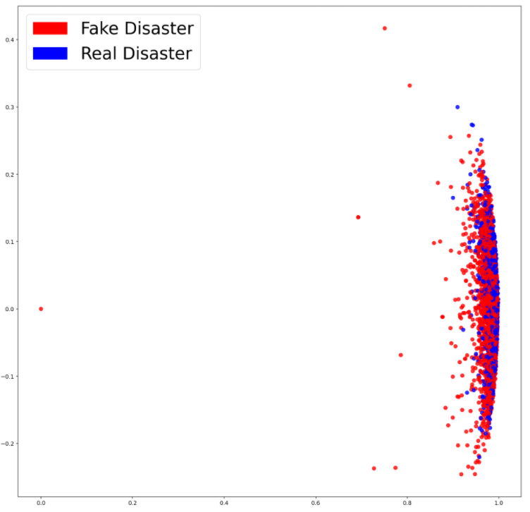
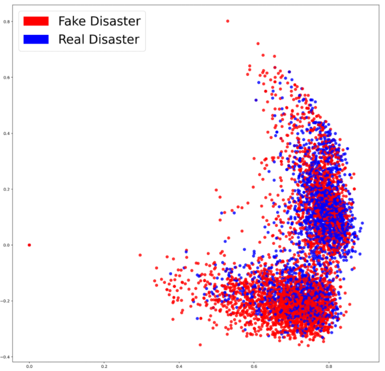
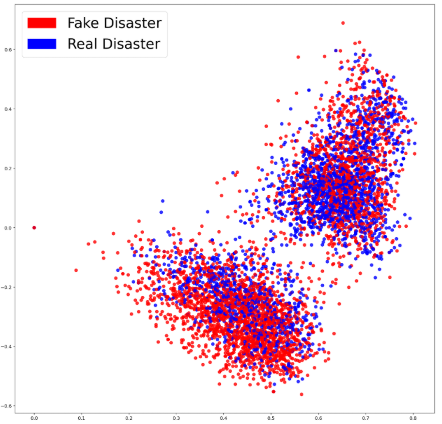
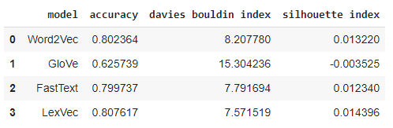

# Refining word embedding

The objective is to implement different word embeddings and investigate the performance on a dataset. For this task, the chosen dataset includes tweets about disasters, e.g., earthquake, wildfire. Among the tweets, some are fake and some are real. So, there are two labels such as 1:Real tweet and 0: Fake tweet. This data has been chosen so that we can see if the features extracted using different embedding techniques can retain distinguishable information to detect which tweet is fake and which one is real. The data is collected from the following link:

https://www.kaggle.com/c/nlp-getting-started

# Strategy:
The tweets are vectorized using four different embedding approaches. Those are the followings:

1. Word2Vec.
2. GloVe.
3. FastText.
4. LexVec.

The following steps are performed:

1. Pre-trained embeddings are used for vectorization.
2. Average word-embeddings are taken to represent texts.
3. The embeddings are visualized in 2D plane to check linear separability between the two classes.
4. Classification has been performed using Logistic Regression.
5. Devis Bouldin Index and Silhouette Index are calculated.

# Performance Metric:

Three performance metrics have been chosen. Those are the followings:

1. Accuracy: Calculates the percentage of the correct predictions. 
2. Devis Bouldin Index: Evaluates intra-cluster similarity and inter-cluster differences. The minimum score is 0, with a lower value indicating better separation.
3. Silhouette Index: Measure the distance between each data point, the centroid of the cluster it was assigned to and the closest centroid belonging to another cluster. The value ranges between 1 and -1 when the best separation is indicated as 1, 0 indicates overlapping and, worst is -1. Negative values generally indicate the wrong label. 

# Performance:

#### Visualizing Word2Vec Model

#### Visualizing Glove Model

#### Visualizing FastText Model

#### Visualizing LexVec Model

#### Evaluation:

# How to run:

Please check the Refining_WordEmbedding.ipynb file for the detialed analysis. This file can be directly accessed through the following link:

https://colab.research.google.com/drive/1KOWPsrmHJRpublrV1OjKa3TchdPuOFs9?usp=sharing

# Provided Contents:

The following files have to be in the same directory to run the main python file (Refining_WordEmbedding.ipynb):

1. train.csv (dataset)
2. stopwords.txt (collection of stopwords)
3. GoogleNews-vectors-negative300.bin.gz (pre-trained embeddings for Word2Vec)
4. glove.6B.300d.txt (pre-trained embeddings for GloVe)
5. wiki.simple.vec (pre-trained embeddings for FastText)
6. lexvec.enwiki+newscrawl.300d.W.pos.vectors (pre-trained embeddings for LexVec)

The files can be found in the following drive:
